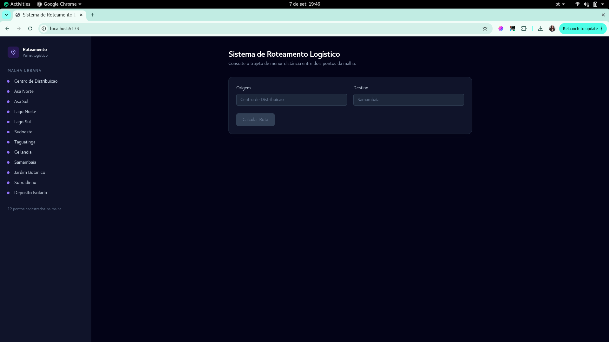
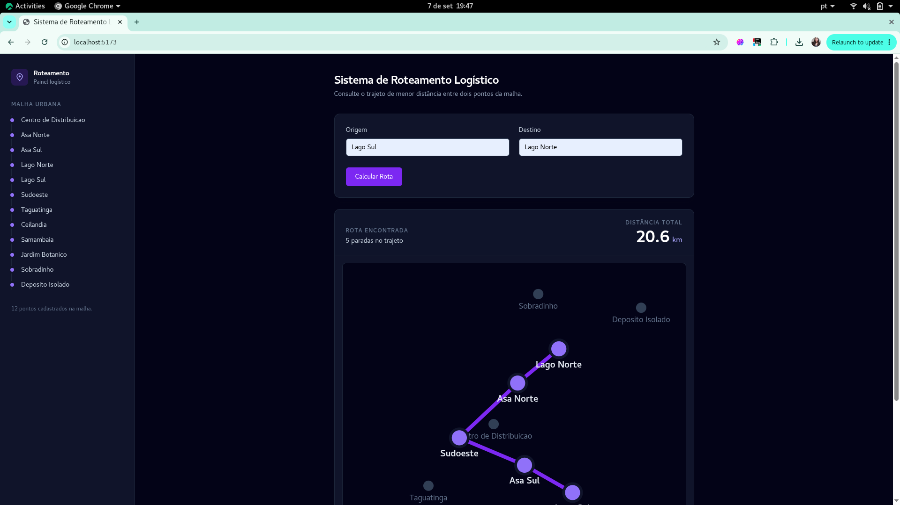
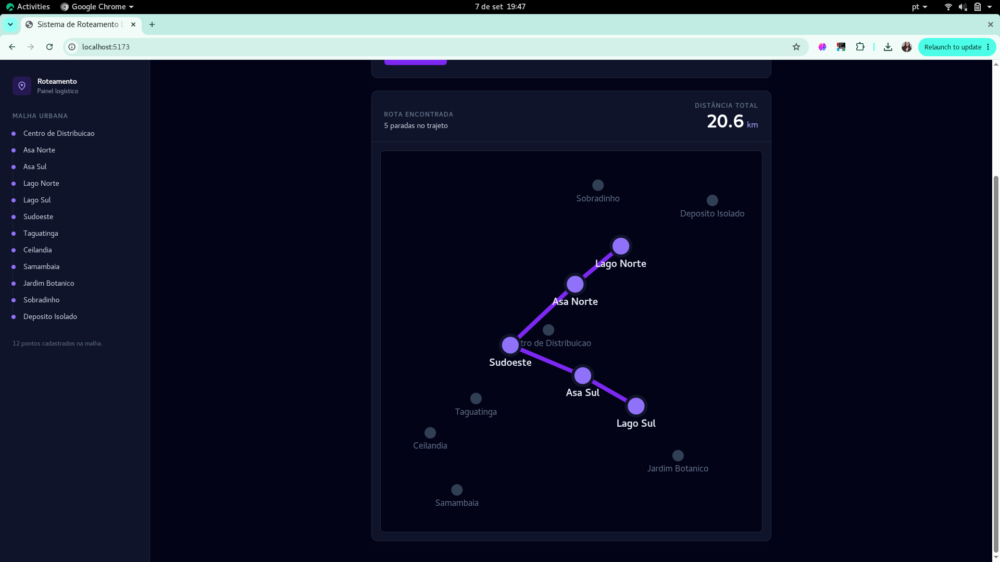

# UrbanRoutingDelivery

Número da Lista: 1<br>
Conteúdo da Disciplina: Grafos<br>

## Alunos

| Matrícula | Aluno |
| -- | -- |
| 231029340 | Thiago Viriato Accioly |
| 231039140 | Marjorie Mitzi Cavalcante Rodrigues |

## Sobre

O **UrbanRoutingDelivery** é um sistema distribuído de roteamento logístico que calcula a menor distância entre pontos de uma malha urbana baseada no Distrito Federal. O objetivo do projeto é demonstrar a aplicação prática da Teoria dos Grafos utilizando o **Algoritmo de Dijkstra**.

A estrutura de dados principal implementada no núcleo do sistema adota os seguintes preceitos:
* **Grafo Não-Direcionado (Undirected):** As conexões (arestas) representam vias de mão dupla entre os locais.
* **Grafo Ponderado (Weighted):** Cada aresta possui um peso numérico correspondente à distância em quilômetros.
* **Grafo Desconexo (Disconnected):** O sistema lida com vértices inalcançáveis (como o ponto "Deposito Isolado") para tratar exceções de roteamento.

## Screenshots







## Instalação

**Linguagem:** C++ (Core), JavaScript (API e Frontend)<br>
**Framework:** Express (Node.js), React/Vite (Frontend)<br>

**Pré-requisitos:**
* Compilador C++ (g++) e CMake
* Node.js e npm

**Comandos de Instalação:**

1. **Compilando o Core em C++** (Na raiz do repositório):

```bash
cmake -S . -B build
cmake --build build


## Subindo o Frontend (React) (Em um novo terminal)


cd frontend
npm install
npm run dev


## Uso

1. Após iniciar a API e o Frontend, acesse `http://localhost:5173` no seu navegador.
2. No menu lateral, você verá os pontos cadastrados na malha urbana.
3. Digite o nome exato do ponto de **Origem** (ex: `Centro de Distribuicao` - sem acentos) e do ponto de **Destino** (ex: `Lago Sul`).
4. Clique em **Calcular Rota**. O sistema consultará o binário em C++ e traçará o menor trajeto na interface.

## Outros

**Apresentação do Projeto (Vídeo):**  
[Assistir no YouTube - Apresentação Módulo 1](https://www.youtube.com/watch?v=t_nHIikhSYg)

**Arquitetura do Sistema:**  
O projeto foi dividido em três camadas para garantir a Separação de Responsabilidades (Separation of Concerns):

* **Core (C++)**: Motor matemático de alta performance responsável pelo grafo.
* **API (Node.js)**: Camada intermediária que expõe o executável C++ via HTTP (`child_process`).
* **Frontend (React)**: Interface gráfica interativa para o usuário final.

